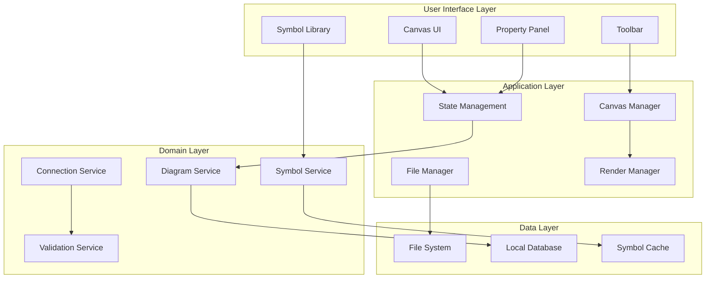

# P&ID Editor - Technical Architecture Document

## System Overview

The P&ID Editor is a diagram editing application for creating and modifying Piping and Instrumentation Diagrams using standardized symbols (ISO and PIP). This document outlines the technical architecture for both implementation approaches.

## High-Level Architecture



## Core Components

### 1. Symbol Management System

#### Data Model
```typescript
interface Symbol {
  id: string;                    // Unique identifier
  name: string;                   // Display name
  category: SymbolCategory;       // Equipment, Valves, etc.
  standard: 'ISO' | 'PIP';       // Standard type
  svgContent: string;            // SVG data
  thumbnailUrl: string;          // Preview image
  connectionPoints: Point[];      // Red markers from SVG
  metadata: {
    tags: string[];              // Searchable tags
    description: string;         // Symbol description
    version: string;             // Symbol version
  };
}

interface Point {
  x: number;
  y: number;
  type: 'input' | 'output' | 'bidirectional';
  angle: number;                 // Connection angle for routing
}

enum SymbolCategory {
  Equipment = 'equipment',
  Valves = 'valves',
  Instruments = 'instruments',
  Fittings = 'fittings',
  PipesAndSignals = 'pipes_and_signals'
}
```

#### Symbol Loading Pipeline
```
1. Scan symbol directories (ISO/PIP)
2. Parse SVG files
3. Extract connection points (red markers)
4. Generate thumbnails
5. Build search index
6. Cache in memory/disk
```

### 2. Canvas Architecture

#### Layered Rendering System
```typescript
class CanvasLayer {
  zIndex: number;
  visible: boolean;
  locked: boolean;
  opacity: number;
}

class CanvasManager {
  layers: {
    background: CanvasLayer;    // Grid, guides
    symbols: CanvasLayer;        // P&ID symbols
    connections: CanvasLayer;    // Pipes, signals
    annotations: CanvasLayer;    // Text, labels
    selection: CanvasLayer;      // Selection highlights
    overlay: CanvasLayer;        // Temporary drawings
  };
}
```

#### Coordinate System
```typescript
interface CoordinateSystem {
  // World coordinates (diagram space)
  worldBounds: Rectangle;
  
  // View coordinates (screen space)
  viewBounds: Rectangle;
  
  // Transformation matrix
  transform: {
    scale: number;
    translateX: number;
    translateY: number;
    rotation: number;
  };
  
  // Conversion methods
  worldToView(point: Point): Point;
  viewToWorld(point: Point): Point;
}
```

### 3. Connection Routing System

#### Connection Model
```typescript
interface Connection {
  id: string;
  source: {
    elementId: string;
    pointIndex: number;
  };
  target: {
    elementId: string;
    pointIndex: number;
  };
  style: ConnectionStyle;
  path: Path;
  routing: RoutingAlgorithm;
}

interface ConnectionStyle {
  strokeWidth: number;
  strokeColor: string;
  strokeDasharray?: string;  // For dashed/dotted lines
  arrowStart?: ArrowStyle;
  arrowEnd?: ArrowStyle;
}

enum RoutingAlgorithm {
  Direct = 'direct',           // Straight line
  Orthogonal = 'orthogonal',   // Right angles only
  Curved = 'curved',           // Bezier curves
  Smart = 'smart'              // A* pathfinding
}
```

#### Routing Algorithms

**Orthogonal Routing (Most Common for P&ID)**
```typescript
function calculateOrthogonalPath(
  start: Point,
  end: Point,
  obstacles: Rectangle[]
): Path {
  // 1. Determine primary direction
  const horizontal = Math.abs(end.x - start.x) > Math.abs(end.y - start.y);
  
  // 2. Calculate intermediate points
  const points: Point[] = [start];
  
  if (horizontal) {
    // Route horizontally first
    const midX = start.x + (end.x - start.x) / 2;
    points.push({ x: midX, y: start.y });
    points.push({ x: midX, y: end.y });
  } else {
    // Route vertically first
    const midY = start.y + (end.y - start.y) / 2;
    points.push({ x: start.x, y: midY });
    points.push({ x: end.x, y: midY });
  }
  
  points.push(end);
  
  // 3. Avoid obstacles if needed
  return avoidObstacles(points, obstacles);
}
```

**A* Pathfinding for Complex Routing**
```typescript
class PathFinder {
  private grid: Grid;
  
  findPath(start: Point, end: Point): Path {
    const openSet = new PriorityQueue<Node>();
    const closedSet = new Set<Node>();
    
    const startNode = this.grid.getNode(start);
    openSet.enqueue(startNode, 0);
    
    while (!openSet.isEmpty()) {
      const current = openSet.dequeue();
      
      if (current.equals(end)) {
        return this.reconstructPath(current);
      }
      
      closedSet.add(current);
      
      for (const neighbor of this.getNeighbors(current)) {
        if (closedSet.has(neighbor)) continue;
        
        const tentativeScore = current.g + this.distance(current, neighbor);
        
        if (tentativeScore < neighbor.g) {
          neighbor.parent = current;
          neighbor.g = tentativeScore;
          neighbor.f = neighbor.g + this.heuristic(neighbor, end);
          
          if (!openSet.contains(neighbor)) {
            openSet.enqueue(neighbor, neighbor.f);
          }
        }
      }
    }
    
    return null; // No path found
  }
}
```

### 4. State Management

#### Application State Structure
```typescript
interface AppState {
  // Document state
  diagram: {
    id: string;
    name: string;
    elements: DiagramElement[];
    connections: Connection[];
    metadata: DiagramMetadata;
  };
  
  // UI state
  ui: {
    selectedElements: Set<string>;
    copiedElements: DiagramElement[];
    zoom: number;
    pan: Point;
    activeTool: Tool;
    showGrid: boolean;
    snapToGrid: boolean;
  };
  
  // History for undo/redo
  history: {
    past: DiagramState[];
    present: DiagramState;
    future: DiagramState[];
  };
  
  // Symbol library state
  symbols: {
    loaded: Symbol[];
    filtered: Symbol[];
    searchQuery: string;
    selectedCategory: SymbolCategory;
  };
}
```

#### State Management Patterns

**Command Pattern for Undo/Redo**
```typescript
interface Command {
  execute(): void;
  undo(): void;
  redo(): void;
}

class AddElementCommand implements Command {
  constructor(
    private diagram: Diagram,
    private element: DiagramElement
  ) {}
  
  execute() {
    this.diagram.addElement(this.element);
  }
  
  undo() {
    this.diagram.removeElement(this.element.id);
  }
  
  redo() {
    this.execute();
  }
}

class CommandManager {
  private history: Command[] = [];
  private currentIndex = -1;
  
  execute(command: Command) {
    // Remove any commands after current index
    this.history = this.history.slice(0, this.currentIndex + 1);
    
    // Add and execute new command
    this.history.push(command);
    command.execute();
    this.currentIndex++;
  }
  
  undo() {
    if (this.currentIndex >= 0) {
      this.history[this.currentIndex].undo();
      this.currentIndex--;
    }
  }
  
  redo() {
    if (this.currentIndex < this.history.length - 1) {
      this.currentIndex++;
      this.history[this.currentIndex].redo();
    }
  }
}
```

### 5. File Operations

#### File Format Specification
```typescript
// Native format (.pid)
interface PIDFileFormat {
  version: '1.0.0';
  metadata: {
    created: ISO8601String;
    modified: ISO8601String;
    author: string;
    software: string;
  };
  diagram: {
    elements: SerializedElement[];
    connections: SerializedConnection[];
    settings: DiagramSettings;
  };
  resources: {
    customSymbols?: EmbeddedSymbol[];
    fonts?: EmbeddedFont[];
  };
}

// Export formats
interface ExportFormats {
  svg: {
    embedSymbols: boolean;
    includeMetadata: boolean;
    optimize: boolean;
  };
  png: {
    resolution: number;
    transparent: boolean;
    scale: number;
  };
  pdf: {
    pageSize: 'A4' | 'A3' | 'Letter';
    orientation: 'portrait' | 'landscape';
    margins: number;
  };
  dxf: {
    version: 'R2018' | 'R2013';
    units: 'mm' | 'inch';
  };
}
```

#### File Operations Service
```typescript
class FileService {
  async saveDiagram(diagram: Diagram, path: string): Promise<void> {
    const serialized = this.serialize(diagram);
    const compressed = await this.compress(serialized);
    await this.writeFile(path, compressed);
  }
  
  async loadDiagram(path: string): Promise<Diagram> {
    const data = await this.readFile(path);
    const decompressed = await this.decompress(data);
    return this.deserialize(decompressed);
  }
  
  async exportSVG(diagram: Diagram): Promise<string> {
    const svg = this.renderToSVG(diagram);
    return this.optimizeSVG(svg);
  }
  
  async exportPNG(diagram: Diagram, options: PNGOptions): Promise<Blob> {
    const svg = await this.exportSVG(diagram);
    return this.svgToPNG(svg, options);
  }
}
```

### 6. Performance Optimization

#### Virtualization Strategy
```typescript
class VirtualRenderer {
  private viewport: Rectangle;
  private visibleElements: Set<DiagramElement>;
  
  updateViewport(viewport: Rectangle) {
    this.viewport = viewport;
    this.updateVisibleElements();
  }
  
  private updateVisibleElements() {
    this.visibleElements.clear();
    
    for (const element of this.diagram.elements) {
      if (this.isInViewport(element)) {
        this.visibleElements.add(element);
      }
    }
  }
  
  private isInViewport(element: DiagramElement): boolean {
    return this.viewport.intersects(element.bounds);
  }
  
  render() {
    // Only render visible elements
    for (const element of this.visibleElements) {
      this.renderElement(element);
    }
  }
}
```

#### Caching Strategy
```typescript
class SymbolCache {
  private memoryCache: Map<string, RenderedSymbol>;
  private diskCache: DiskCache;
  
  async getSymbol(id: string): Promise<RenderedSymbol> {
    // L1: Memory cache
    if (this.memoryCache.has(id)) {
      return this.memoryCache.get(id);
    }
    
    // L2: Disk cache
    const diskSymbol = await this.diskCache.get(id);
    if (diskSymbol) {
      this.memoryCache.set(id, diskSymbol);
      return diskSymbol;
    }
    
    // L3: Load and process
    const symbol = await this.loadSymbol(id);
    const rendered = await this.renderSymbol(symbol);
    
    // Cache for future use
    this.memoryCache.set(id, rendered);
    await this.diskCache.set(id, rendered);
    
    return rendered;
  }
}
```

#### Level of Detail (LOD)
```typescript
class LODRenderer {
  private zoomLevels = {
    high: 2.0,    // Full detail
    medium: 1.0,  // Normal detail
    low: 0.5,     // Simplified
    minimal: 0.25 // Icons only
  };
  
  renderElement(element: DiagramElement, zoom: number) {
    if (zoom >= this.zoomLevels.high) {
      return this.renderFullDetail(element);
    } else if (zoom >= this.zoomLevels.medium) {
      return this.renderNormalDetail(element);
    } else if (zoom >= this.zoomLevels.low) {
      return this.renderSimplified(element);
    } else {
      return this.renderIcon(element);
    }
  }
}
```

### 7. Event System

#### Event Bus Architecture
```typescript
class EventBus {
  private listeners: Map<string, Set<EventListener>>;
  
  on(event: string, callback: EventListener) {
    if (!this.listeners.has(event)) {
      this.listeners.set(event, new Set());
    }
    this.listeners.get(event).add(callback);
  }
  
  off(event: string, callback: EventListener) {
    this.listeners.get(event)?.delete(callback);
  }
  
  emit(event: string, data: any) {
    this.listeners.get(event)?.forEach(callback => {
      callback(data);
    });
  }
}

// Event types
enum DiagramEvents {
  ElementAdded = 'element:added',
  ElementRemoved = 'element:removed',
  ElementModified = 'element:modified',
  ConnectionAdded = 'connection:added',
  ConnectionRemoved = 'connection:removed',
  SelectionChanged = 'selection:changed',
  ZoomChanged = 'zoom:changed',
  DocumentSaved = 'document:saved',
  DocumentModified = 'document:modified'
}
```

### 8. Validation System

#### Validation Rules
```typescript
interface ValidationRule {
  id: string;
  name: string;
  severity: 'error' | 'warning' | 'info';
  validate(diagram: Diagram): ValidationResult[];
}

class ConnectionValidation implements ValidationRule {
  id = 'connection-validation';
  name = 'Connection Validation';
  severity = 'error' as const;
  
  validate(diagram: Diagram): ValidationResult[] {
    const results: ValidationResult[] = [];
    
    for (const connection of diagram.connections) {
      // Check if connection points exist
      if (!this.hasValidEndpoints(connection, diagram)) {
        results.push({
          ruleId: this.id,
          severity: this.severity,
          message: `Connection ${connection.id} has invalid endpoints`,
          elementId: connection.id
        });
      }
      
      // Check for connection type compatibility
      if (!this.areTypesCompatible(connection, diagram)) {
        results.push({
          ruleId: this.id,
          severity: 'warning',
          message: `Connection types may not be compatible`,
          elementId: connection.id
        });
      }
    }
    
    return results;
  }
}
```

### 9. Plugin Architecture

#### Plugin System
```typescript
interface Plugin {
  id: string;
  name: string;
  version: string;
  initialize(context: PluginContext): void;
  destroy(): void;
}

interface PluginContext {
  diagram: Diagram;
  canvas: Canvas;
  commands: CommandManager;
  eventBus: EventBus;
  
  // Plugin API
  registerTool(tool: Tool): void;
  registerSymbol(symbol: Symbol): void;
  registerExporter(exporter: Exporter): void;
  registerValidator(validator: ValidationRule): void;
}

class PluginManager {
  private plugins: Map<string, Plugin> = new Map();
  
  async loadPlugin(path: string) {
    const module = await import(path);
    const plugin = new module.default() as Plugin;
    
    plugin.initialize(this.context);
    this.plugins.set(plugin.id, plugin);
  }
  
  unloadPlugin(id: string) {
    const plugin = this.plugins.get(id);
    plugin?.destroy();
    this.plugins.delete(id);
  }
}
```

## Security Considerations

### 1. Input Validation
```typescript
class SecurityValidator {
  validateSVG(svg: string): boolean {
    // Check for malicious scripts
    if (/<script/i.test(svg)) return false;
    
    // Check for external references
    if (/xlink:href\s*=\s*["'](?!#)/i.test(svg)) return false;
    
    // Validate against whitelist of allowed elements
    return this.validateElements(svg);
  }
  
  sanitizeSVG(svg: string): string {
    // Remove scripts
    svg = svg.replace(/<script\b[^<]*(?:(?!<\/script>)<[^<]*)*<\/script>/gi, '');
    
    // Remove event handlers
    svg = svg.replace(/\son\w+\s*=\s*["'][^"']*["']/gi, '');
    
    // Remove external references
    svg = svg.replace(/xlink:href\s*=\s*["'](?!#)[^"']*["']/gi, '');
    
    return svg;
  }
}
```

### 2. File Access Control
```typescript
class FileAccessControl {
  private allowedPaths: string[] = [
    'documents',
    'downloads',
    'desktop'
  ];
  
  canAccess(path: string): boolean {
    const normalized = this.normalizePath(path);
    return this.allowedPaths.some(allowed => 
      normalized.startsWith(allowed)
    );
  }
  
  private normalizePath(path: string): string {
    // Resolve relative paths
    // Remove directory traversal attempts
    return path.replace(/\.\./g, '');
  }
}
```

## Testing Strategy

### 1. Unit Testing
```typescript
// Symbol loading tests
describe('SymbolLoader', () => {
  it('should load ISO symbols', async () => {
    const loader = new SymbolLoader();
    const symbols = await loader.loadISO();
    expect(symbols.length).toBe(227);
  });
  
  it('should extract connection points', () => {
    const svg = '<circle stroke="#ff0000" cx="10" cy="10" r="2"/>';
    const points = extractConnectionPoints(svg);
    expect(points).toEqual([{ x: 10, y: 10 }]);
  });
});
```

### 2. Integration Testing
```typescript
// Canvas interaction tests
describe('Canvas Integration', () => {
  it('should add symbol on drop', async () => {
    const canvas = new Canvas();
    const symbol = await loadSymbol('valve');
    
    canvas.handleDrop(symbol, { x: 100, y: 100 });
    
    expect(canvas.elements.length).toBe(1);
    expect(canvas.elements[0].position).toEqual({ x: 100, y: 100 });
  });
});
```

### 3. Performance Testing
```typescript
// Performance benchmarks
describe('Performance', () => {
  it('should render 1000 symbols at 60fps', () => {
    const canvas = new Canvas();
    const symbols = generateSymbols(1000);
    
    const startTime = performance.now();
    canvas.render(symbols);
    const renderTime = performance.now() - startTime;
    
    expect(renderTime).toBeLessThan(16.67); // 60fps
  });
});
```

## Deployment Architecture

### Desktop Distribution
```yaml
platforms:
  windows:
    installer: NSIS
    auto_update: Squirrel.Windows
    code_signing: EV Certificate
    
  macos:
    installer: DMG
    auto_update: Sparkle
    notarization: Required
    
  linux:
    formats: [AppImage, Snap, Flatpak]
    repositories: [AUR, PPA]
```

### Update System
```typescript
class AutoUpdater {
  private updateUrl = 'https://api.example.com/updates';
  
  async checkForUpdates() {
    const currentVersion = app.getVersion();
    const response = await fetch(`${this.updateUrl}/${currentVersion}`);
    const update = await response.json();
    
    if (update.available) {
      return {
        version: update.version,
        releaseNotes: update.notes,
        downloadUrl: update.url
      };
    }
    
    return null;
  }
  
  async downloadAndInstall(update: Update) {
    const installer = await this.download(update.downloadUrl);
    await this.verifySignature(installer);
    await this.install(installer);
    app.relaunch();
  }
}
```

## Monitoring and Analytics

### Performance Monitoring
```typescript
class PerformanceMonitor {
  private metrics: Map<string, Metric> = new Map();
  
  measure(name: string, fn: () => void) {
    const start = performance.now();
    fn();
    const duration = performance.now() - start;
    
    this.recordMetric(name, duration);
  }
  
  recordMetric(name: string, value: number) {
    if (!this.metrics.has(name)) {
      this.metrics.set(name, {
        count: 0,
        total: 0,
        min: Infinity,
        max: -Infinity
      });
    }
    
    const metric = this.metrics.get(name);
    metric.count++;
    metric.total += value;
    metric.min = Math.min(metric.min, value);
    metric.max = Math.max(metric.max, value);
  }
  
  getReport() {
    const report = {};
    for (const [name, metric] of this.metrics) {
      report[name] = {
        average: metric.total / metric.count,
        min: metric.min,
        max: metric.max,
        count: metric.count
      };
    }
    return report;
  }
}
```

## Future Enhancements

### 1. Collaboration Features
- Real-time collaboration using WebRTC/WebSocket
- Conflict resolution for concurrent edits
- Comments and annotations
- Version control integration

### 2. AI-Powered Features
- Auto-routing suggestions
- Symbol recognition from sketches
- Diagram validation and optimization
- Intelligent search and filtering

### 3. Advanced Visualization
- 3D diagram views
- Animated flow simulation
- Heat maps and analytics
- AR/VR support for spatial diagrams

### 4. Integration Capabilities
- CAD software integration (AutoCAD, SolidWorks)
- ERP system connectors
- Cloud storage providers
- Industry-specific tools

---

*Last Updated: December 2024*
*Version: 1.0*